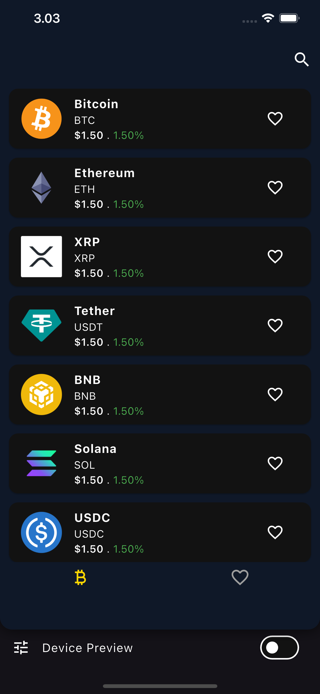
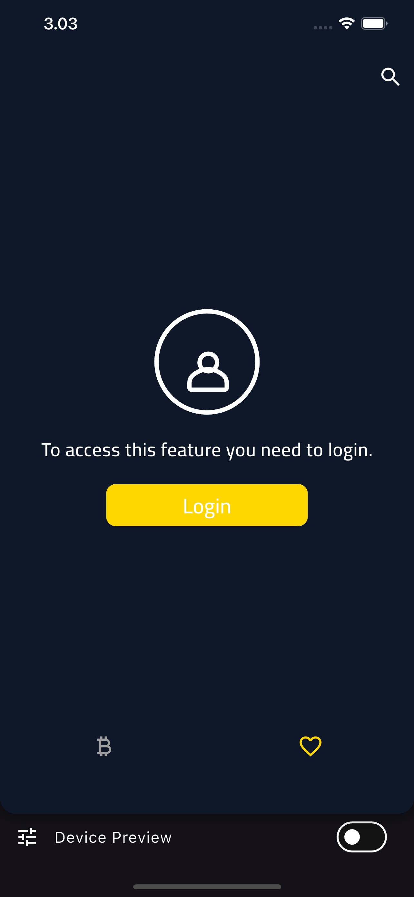
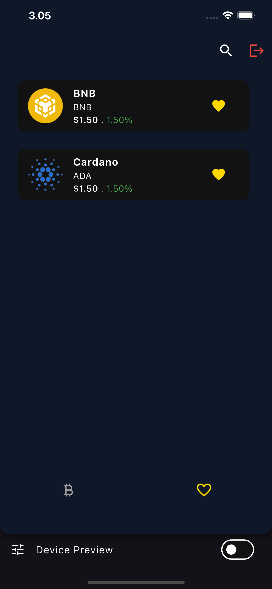
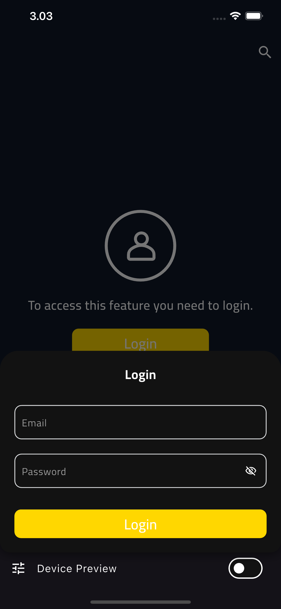
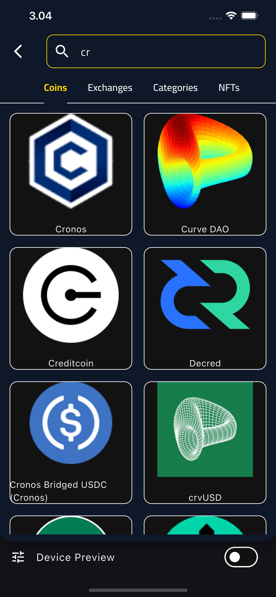

# Crypto Tracker App

A Flutter application for tracking cryptocurrency prices with secure authentication, offline support, and comprehensive search functionality.

## Features

### Core Functionality

- **Two Main Tabs**:

  - **Crypto List**: Paginated list of cryptocurrencies
  - **Wishlist**: Saved cryptocurrencies (requires login)

- **Search Functionality**:

  - Unified search across coins, categories, exchanges, and NFTs

- **Authentication**:
  - Login via bottom sheet
  - Mock login implementation
  - Secure token storage using `flutter_secure_storage`

### Technical Highlights

- **Dio** for efficient HTTP requests
- **GoRouter** for declarative routing
- **Isar** for offline data persistence
- **BLoC** for state management
- **Dependency Injection** using `get_it` and `injectable`
- **Freezed** for immutable crypto parameter models

## Screenshots

  <h3>Main Interface</h3>
  
    
  
  
  <h3>User Flow</h3>
  
  

## Technical Implementation

### Packages Used

| Category             | Packages                                    |
| -------------------- | ------------------------------------------- |
| Networking           | `dio`                                       |
| Routing              | `go_router`                                 |
| Local Storage        | `isar`, `flutter_secure_storage`            |
| State Management     | `flutter_bloc`                              |
| Dependency Injection | `get_it`, `injectable`                      |
| Data Modeling        | `freezed`, `json_serializable`, `equatable` |

## Getting Started

1. Clone the repository
2. Run `flutter pub get`
3. Generate required files: `dart run build_runner build`
4. Run `flutter run`

## Key Features

### Crypto List Tab

- Paginated data loading
- Real-time price updates
- Offline-first design

### Authentication Flow

- Secure token storage
- Protected routes
- Smooth bottom sheet animation

## Future Enhancements

- Real API integration
- Portfolio tracking
- Advanced charting

## Contributors

**ENG. Noura**
